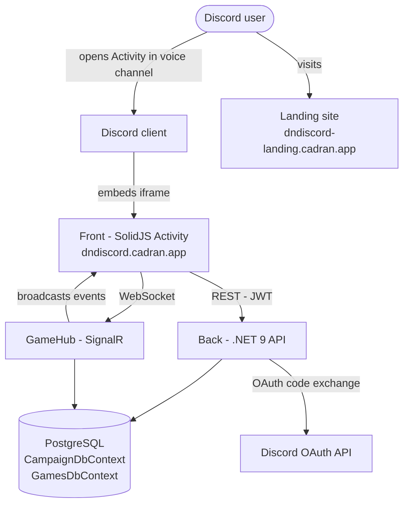

# DnDiscord - Architecture Overview

> Audience: new contributor or evaluator who has read the root `README.md` and wants the full system picture across all repos.
> Scope: POC. This document stays intentionally lean.

---

## Components

- **`back/`** - .NET 9 REST API and SignalR hub. Handles Discord OAuth -> JWT authentication, campaign and character CRUD, real-time multiplayer via `GameHub`, and persistence through two PostgreSQL databases (EF Core, migrations applied at startup). See `back/README.md` for the full module breakdown and sequence diagrams.

- **`front/`** - SolidJS + TypeScript Discord Activity iframe app. Renders a 3D turn-based battle map with BabylonJS 7, communicates with the backend over axios (REST) and `@microsoft/signalr` (WebSocket). Shipped as a single Docker container served by nginx. See `front/README.md` for the engine architecture, store layout, and nginx caching tiers.

- **`landing/`** - React + TypeScript + Vite marketing landing page, independent of the Activity stack. Deployed separately at `dndiscord-landing.cadran.app`. Design tokens and brand guidelines are documented in `landing/Design.MD`.

---

## High-level diagram

---

## Data flow - typical campaign session

1. **User opens Activity** - Discord embeds the front-end iframe from `dndiscord.cadran.app`. The SolidJS app initializes the Discord Embedded App SDK and detects it is running inside the Activity proxy.

2. **JWT authentication via Discord OAuth** - The front calls `GET /api/auth/discord/redirect`; the backend returns a 302 to Discord's OAuth consent screen. After consent, Discord sends the code to `POST /api/auth/discord/callback`, which exchanges it for a user profile, issues a 7-day JWT, and immediately revokes the Discord access token. The JWT is stored in `localStorage` via `auth.store.ts`.

3. **SignalR hub connection** - `SignalRService.ts` opens a WebSocket to `/hubs/game?access_token=<jwt>` (WebSocket-only transport, required by the Discord Activity proxy). The DM calls `CreateSession(campaignId)` on `GameHub`; players call `JoinSession(sessionId)` and optionally `SelectCharacter(characterId)`.

4. **CRUD via REST** - Campaigns, characters, inventory, and maps are read and written through axios services (`campaign.service.ts`, `character.service.ts`, `map.service.ts`, etc.) against the Campaign and Games module endpoints. Responses are normalized by `campaign.mappers.ts` and `multiplayer.normalizers.ts` before reaching the stores.

5. **Map renders in BabylonJS** - The DM calls `StartGame(mapId)` on the hub. The server broadcasts `GameStarted` with spawn positions; `gameSync.ts` handles the event, populates `UnitsStore` and `TilesStore`, and the `GameCanvas` tiles effect triggers `BabylonEngine.createGrid()` to render the 3D scene via `GridRenderer` and `LightManager`.

6. **Turn-based combat over the hub** - `DmStartCombat()` triggers initiative rolls on the server (`CombatManager`), which broadcasts `CombatStarted` to all clients. Players submit `EndTurn(payload)` with movement and AP spend; the server advances the `CombatState` FSM and broadcasts `TurnEnded` to all participants. The `CombatManager` FSM transitions between `FreeRoam`, `Preparation`, `PlayerTurn`, `EnemyTurn`, and `Resolved` phases.

7. **Session ends** - The DM calls `LeaveSession()` or `DmEndCombat()`. The hub broadcasts `SessionEnded` to all clients; the front navigates back to the lobby. Completed session history and roll logs are available afterward via `GET /api/campaigns/{id}/sessions/history` and `GET /api/campaigns/{id}/rolls`.

---

## Persistence

The backend maintains two PostgreSQL databases managed by EF Core. Migrations run automatically at application startup.

- **`CampaignDbContext`** (connection string key `DefaultConnection`) - owns everything campaign-scoped: campaigns, members, sessions, snapshots, maps (stored as a `jsonb` blob), and roll history. Also holds auth-related data including Discord ID mappings and GDPR tombstone records.

- **`GamesDbContext`** (connection string key `gamesdb`) - owns player-owned game entities: characters (with abilities, HP, level), wallet (copper/silver/gold/platinum), and inventory entries against the item catalog.

Cross-module operations that span both contexts (e.g. `GameHub` granting loot or XP) go through thin adapter interfaces (`IInventoryGrantService`, `ICharacterProgressionService`, `ICampaignMapLookupService`, `ICharacterLookupService`) whose concrete implementations live in the top-level `DnDiscordAPI` project to avoid circular references. See `back/README.md` for the full adapter diagram.

---

## Integration boundary - back and front

The front communicates with the back over two channels. REST calls use axios with a JWT `Authorization` header injected by `api.ts`; all campaign, character, inventory, map, snapshot, and auth operations go through this channel. Real-time multiplayer uses a single SignalR WebSocket connection (`SignalRService.ts`) to `/hubs/game`, with WebSocket-only transport (no long-polling fallback). The Discord Activity iframe enforces a strict CSP: no `eval`, no `Function()`, no external CDN resources. As a result, all JavaScript, fonts, icons, and BabylonJS assets are bundled or self-hosted; BabylonJS model loading uses `LoadAssetContainerAsync` with pre-instantiated templates rather than any dynamic evaluation path. nginx handles static asset caching tiers and the SPA fallback; the WebSocket upgrade goes directly to the backend.

---

## Where to dig deeper

- [`back/README.md`](../back/README.md) - module breakdown, Mermaid architecture and auth sequence diagrams, combat state machine, test strategy, and CI/CD pipeline for the .NET backend.
- [`front/README.md`](../front/README.md) - SolidJS routing, store inventory, BabylonJS engine architecture and hard rules, SignalR event reference, nginx caching, and front-end test coverage map.
- [`landing/README.md`](../landing/README.md) - landing page stack setup; see also [`landing/Design.MD`](../landing/Design.MD) for the full brand and design-token system.
- [`docs/DELIVERY_WORKFLOW.md`](DELIVERY_WORKFLOW.md) - branching strategy, PR process, and deployment flow across all three repos.
