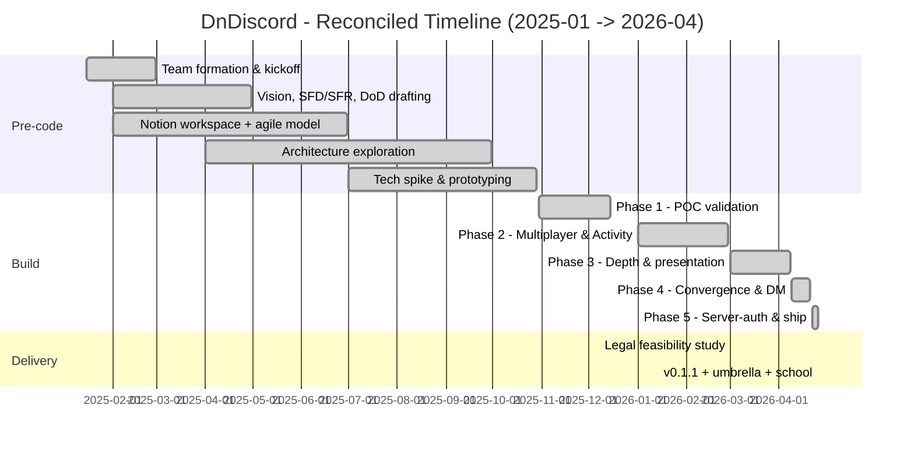

# DnDiscord - Project History

How DnDiscord went from a kickoff sketch to the v0.1.1 POC delivered on 2026-04-26. This document is the retrospective companion to [WAYS_OF_WORKING.md](./WAYS_OF_WORKING.md), which describes the operational model still in effect.

> POC project for Epitech MSc Pro 2026, module T-ESP-902-96859. Owner: Quentin Berger ([@aCuriousDev](https://github.com/aCuriousDev)). Source of truth: `aCuriousDev/dnDiscord-umbrella`. School mirror: `EpitechMscProPromo2026/T-ESP-902-96859-LYO_DnDiscord`.

---

## 1. Quick PRD

### Vision

> Turn your Discord server into a D&D table. Stunning 3D adventures, no downloads, no extra accounts, just the magic of tabletop, shared with friends, anywhere.

DnDiscord is a Discord Activity (an embedded web app loaded inside a Discord voice channel) that gives a group of friends an isometric 3D battle map, a campaign system, character sheets, dice, and a Dungeon Master toolkit, all without leaving Discord and without each player setting up a separate account.

### Target users

Four personas surfaced from the communication strategy work and the playtest cycle:

- **The organizing Game Master** - a student GM tired of juggling Roll20 + Discord + PDFs every Sunday.
- **The casual but passionate player** - intimidated by Roll20's UX, wants to play D&D with the same friction as joining a Discord call.
- **The nostalgic veteran** - misses tabletop and is looking for a modern alternative to Roll20 / Foundry.
- **The streamer / TTRPG content creator** - needs visual content for streams without OBS gymnastics.

### MVP scope (delivered in v0.1.1)

- Discord OAuth login inside the Activity iframe.
- Campaign CRUD with members, sessions, maps and roll history.
- Character creation (race / class / stats / HP / wallet / inventory).
- Real-time multiplayer over SignalR: lobby, character selection, game start, unit movement, turn order, combat FSM, end-turn sync.
- Server-authoritative combat state machine (`FreeRoam` -> `Preparation` -> `PlayerTurn` / `EnemyTurn` -> `Resolved`).
- DM toolkit: start/stop combat, switch maps, grant items, grant XP / gold, hidden rolls, request rolls from players, adjust HP.
- Inventory + wallet (copper / silver / gold / platinum), consumable use.
- Map persistence + DM map switch broadcast.
- 3D dungeon editor with teleport portals.
- BG3-style hotbar, isometric camera, in-engine VFX, audio engine, in-game dialogue.
- GDPR endpoints (account export, account deletion, cookie consent, legal pages).
- Tutorial overlay.
- CI on both repos (build, test, EF migration drift check, nginx config validation, production image smoke test).
- Auto-deploy to Dokploy on `dev`, auto-mirror umbrella `main` to school repo.

### What was deliberately cut from the POC

- **Voice chat integration** - native Discord voice already covers the use case for a POC. Re-implementing it inside the iframe was not worth the complexity.
- **AI Dungeon Master assistance** - originally an entire epic with a Router / Game / Movement / Combat / Talk / NPC agent stack. Out of scope for a 6-month student POC.
- **Asset / campaign marketplace** - aspirational monetization feature, irrelevant for a school POC.
- **Microservices + API gateway + RabbitMQ + Redis** - the architecture pivoted to a modular monolith (see §2).
- **Freemium SaaS pricing tiers** - documented in the business plan as the eventual model, not part of the build.

---

## 2. From plan to POC: a deliberate pivot

The legacy Notion workspace describes a microservices platform with an Ocelot API gateway, a Duende Identity Server, a RabbitMQ message bus, a Redis cache, eight specialised services, OpenTelemetry + Seq observability across the fleet, and a 1000+ concurrent user performance budget. That was the right shape to *aim* at on day one, when the team was still scoping the problem space and writing the SFD/SFR and Cybersecurity Plan against an imagined production rollout.

By the time real code started landing in the autumn of 2025, the team had a clearer picture of what was actually achievable in the time and headcount available, and the architecture was deliberately reshaped:

| Originally planned | Delivered POC | Why the pivot |
|---|---|---|
| Microservices + Ocelot gateway | Modular monolith (`DnDiscordAPI`) with module pattern (`Add*Module()` / `Use*Module()`) | A single .NET process keeps deployment, debugging and onboarding tractable for a student team. Module boundaries preserve the option to split later. |
| RabbitMQ message bus | In-process events, SignalR for client-facing real-time | No cross-service traffic needed once the architecture is monolithic. |
| Redis cache | None (PostgreSQL only, two contexts) | Premature for POC scale. Two contexts (`CampaignDbContext`, `GamesDbContext`) keep the data model partitioned cleanly. |
| Duende Identity Server | Direct Discord OAuth2 + ASP.NET JWT bearer | A school project does not need a federated identity server; one OAuth provider is enough. |
| 1000+ concurrent users target | POC scale, Dokploy single instance | Performance budgets that match the actual deployment target. |
| AI agent framework (8 agents) | Cut | Out of scope for the timeline. |
| Voice chat re-implementation | Use Discord native voice | The Activity already runs inside a voice channel. |
| Asset marketplace, freemium tiers | Cut | Product-stage features, not POC features. |

The Notion documents are still useful as the **vision and scoping artefacts** they always were: the Definition of Done, the Quality Plan, the Cybersecurity Plan, the Communication Strategy and the Business Plan all describe what DnDiscord could grow into. The current codebase, the umbrella docs, and this history describe what was actually built.

This pivot is treated as a normal product decision, not a retreat. Building the POC at POC scale is what made it possible to ship a polished, demo-able experience in time for the school delivery.

---

## 3. Team

| Member | Role(s) on this project | Active in repos |
|---|---|---|
| **Nicolas BERVOAS** | Founder / promoter of the original concept, Technical Lead, CyberSec | Initial scoping, architecture direction, Cybersecurity Plan |
| **Quentin BERGER** ([@aCuriousDev](https://github.com/aCuriousDev)) | Project Lead, all-around dev (CI, infra, design system, gameplay, hub, delivery), AI Lead | Backend + frontend + umbrella, ~337 commits |
| **Arthur DUMORTIER** | Multiplayer / SignalR / Discord integration lead | Backend + frontend, ~141 commits |
| **Sam SYAUSWA** | Campaign manager, sessions, multiplayer front | Backend + frontend, ~69 commits |
| **Noé MAZZU** | Auth / GDPR, inventory, character classes | Backend + frontend, ~16 commits |
| **Thomas VIDAL** (`Thoomas08`) | DM tools, audio engine, in-game animations | Backend + frontend, ~17 commits |
| **Nathan GIRARD** (`NathanG2807`) | BabylonJS POC, dungeon editor, map assets | Frontend, ~9 commits |
| **Florent CAPPELLETTI** | DevOps / documentation contributions, Docker setup | Notion docs (Docker setup guide, dev guidelines). Left the school during the project; not in the final commit history. |
| **Esteban** | Cyber / Front contributor at kickoff, documentation contributions | Present at the init meeting, contributed to early documentation. Left the school during the project; not in the final commit history. |

Active contributors in git: 6. Roles below are inferred from the commit history and serve as a reading guide for `git blame`; in practice everyone on the team picked up work outside their primary area when the schedule demanded it.

---

## 4. Reconciled timeline

The Notion roadmap shows project work starting in January 2025. In reality, the first commit on either repo lands on **2025-10-30**. The gap between school project assignment (early 2025) and first code (autumn 2025) was spent on team formation, problem framing, architecture drafting and the documents that now sit in the legacy Notion workspace.

### Pre-code (2025-01 -> 2025-10-29)

- **Jan-Feb 2025** - Team formation, kickoff meeting, Notion workspace stood up. Concept agreed: *Discord Activity, BabylonJS 3D, SolidJS, C# / .NET, WebSocket, AI assist*. First Notion follow-up on **2025-01-28**, second on **2025-02-25**.
- **Feb-Apr 2025** - Vision and scoping documents drafted: SFD, SFR, DoD, Quality Plan, Hardware Requirements, Coding Style, Development Guidelines. Notion-side agile model established (Themes -> Epics -> User Stories -> Tasks).
- **Apr-Sep 2025** - Architecture exploration. Microservices + Ocelot + RabbitMQ + Redis target sketched. Cybersecurity Plan v1.0 drafted (released 2025-12-12). Business Plan + Communication Strategy drafted.
- **Jul-Oct 2025** - Local prototyping and tech spikes (no commits yet - work happened on scratch branches and personal repos).
- **2025-12-07** - First school delivery: Legal Feasibility Study (FR + EN PDFs).

### Phase 1 - POC validation (2025-10-30 -> 2025-12-15)

*Goal: prove the core idea works.*

- **2025-10-30** - First commits on `epi-esp-back` (`9aa40b2`) and `epi-esp-front` (`7de1e92b`). .NET solution + SolidJS scaffold.
- **2025-11-27** - SolidJS + TypeScript + Tailwind base wired (Sam).
- **2025-12-04** - First BabylonJS scene rendering (Nathan, `042765f2`). Campaign CRUD + members + snapshots on backend (Quentin, `c548d5c`, `10dfd21`). Character model with race/class traits.
- **2025-12-11** - Board gameplay loop running: combat + freeroam (Quentin, `cb40c94a`).
- **2025-12-12** - Discord OAuth2 integration live (Quentin, `0802a10`). Docker + nginx config landed (`5ae2ecf0`). Cybersecurity Plan v1.0 finalised in Notion.

By mid-December the team had answered the only question that matters early: *can we build this?* Yes.

### Phase 2 - Multiplayer & Discord Activity foundation (2026-01-01 -> 2026-02-28)

*Goal: turn the local POC into an actual Discord Activity with real-time multiplayer.*

- **2026-01-22 -> 23** - Front-back REST integration (Noé). First SignalR hub on backend (`GameHub`, ping/connect/disconnect, Arthur, `2161bf4`). Matching SignalR service on frontend.
- **2026-02-06** - Auth / security refactor (Noé).
- **2026-02-10 -> 19** - Campaign Manager front (Sam): campaign access page, scene/choice blocks. Game action validation + player kick (Arthur).
- **2026-02-20** - **Discord Activity day** (Arthur, 10+ commits across both repos). Discord Embedded App SDK integrated. nginx + CSP hardened for the Discord iframe (frame-ancestors `*.discordsays.com`, no `X-Frame-Options`). OAuth flow adapted to the iframe scenario. SignalR `MessageHub` added. CORS for Discord origins.
- **2026-02-26** - Real-time unit movement synced over SignalR.

After this phase, DnDiscord is no longer a local web app. It runs inside a Discord voice channel, with players moving units in real time across a shared map.

### Phase 3 - Gameplay depth & presentation layer (2026-03-01 -> 2026-04-08)

*Goal: make it look and feel like a real game.*

- **2026-03-05** - Discord auth refinements, `isDungeonMaster` flag (Arthur). Dokploy + production DB config wired up.
- **2026-03-06** - VFX and animations pass (Thomas).
- **2026-03-12** - Dungeon editor merged: core types, editor wizard, teleport zones, portals (Nathan). Audio engine landed (Thomas, `59d84afc`). Campaign module on backend (Sam).
- **2026-03-13** - **Multiplayer lobby UI + character selection + StartGame** end to end (Quentin, `9b283a2` / `bb890ecd`). Full join flow now works.
- Lower commit velocity than April but high feature surface: voice / party chat, in-game dialogue system, campaign manager node-graph.

### Phase 4 - Feature convergence & DM system (2026-04-09 -> 2026-04-21)

*Goal: close every open feature track before final assembly.*

- **2026-04-09** - GitHub Actions CI online for both repos. SignalR reconnect + session recovery. API URL routing fix for production.
- **2026-04-10** - Voice/chat feature week (Arthur): party chat, Discord voice binding, session invite listener, join code UI, EditCampaign page. Tutorial overlay system.
- **2026-04-11** - **Arcane Grimoire design system sprint** (Quentin): token system, Tailwind extensions, SVG icon infrastructure, JetBrains Mono self-hosted, design tokens applied across the app.
- **2026-04-16** - Campaign Manager merged to the main flow (Sam + Quentin). CI fixes for the cross-platform `package-lock.json` issue.
- **2026-04-17** - **DM tools day**. DM hub methods + DM panel with hidden rolls + grant items (Thomas + Quentin, `1881094` / `eb882291`). Wallet system + inventory UI (Noé). 3D D20 with throw / shake / crit flourishes (Quentin). Test coverage added on backend.
- **2026-04-19** - Inventory + wallet + DM auth gates (Quentin, back). BG3-style hotbar (Quentin, front). DM Start Combat button + `CombatStarted` sync. GDPR endpoints (Noé, both repos).
- **2026-04-20** - Map persistence + `DmSwitchMap`. Map service REST client + DM panel Maps tab. Engine overhaul: restart fix, graphics / debug settings, map editor split (Quentin).
- **2026-04-21** - Session/DM bug pass: BUG-E / I / J / K / L / P resolved across both repos.

### Phase 5 - Server-authoritative rewrite & delivery (2026-04-22 -> 2026-04-26)

*Goal: finalise architecture, ship v0.1.1, hand off to school.*

- **2026-04-22** - Combat state model + FSM moved to server-owned (Quentin, `fd39aa6` + `736ea2e`). Front trusts server-authoritative state. WebSocket-only transport forced for the Discord Activity iframe.
- **2026-04-23** - Server-authoritative combat fixes across both repos. `DmAdjustHp`. Rolling Serilog sink + `/api/dev/log` bridge for browser logs in Seq. ASI idempotency. SignalR refactor centralising sync state. GDPR / legal pages.
- **2026-04-24** - **Safety tags cut** on both repos: `pre-merge-hub-auth-2026-04-24`. Hub-auth combat feature merged (`82c8ea1` / `cbfda9f7`). DM roll request feature: 3D D20 modal + DM panel + result toast. FNV-1a deterministic spawn placement.
- **2026-04-25** - Campaign multi feature merged (Sam). Classes + enemies (Noé, `b813b64`). Playable class portraits. EF migration drift check + production image build CI gate (`d9d991e3`).
- **2026-04-26** - **Delivery day.**
  - `7700523` (back) / `1a686b19` (front): `release: dev -> main (v0.1.1)`. Both children tagged `v0.1.1`.
  - `c825326` (umbrella): school mirror CI workflow (SSH key authentication, since GitHub PATs are blocked by the Epitech SAML org).
  - `c15f6e5` (umbrella): auto-mirror `main` -> school repo workflow.
  - `5b65048` (umbrella): submodules bumped to the v0.1.1 tips.
  - `01fb4f6d` (front): hotfix `nginx`, quote regex containing `{8,}`. Front container had crash-looped on the previous deploy.
  - `83d540f5` / `048f4d54` (front): new Home page + GameShell / MenuShell layout system.
  - `df9ff8cc` (front): final scrollable lobby + GameShell chrome overlap fix.
  - Delivery PDFs added to `delivery/`: business plan, cybersecurity plan, communication strategy + visuals, playtest analytics 01, 50-word pitches (FR + EN).

The umbrella repo itself was assembled the same day. All 15 of its commits are dated 2026-04-26.

---

## 5. Releases

| Tag | Repo(s) | Date | What it covers |
|---|---|---|---|
| `pre-merge-hub-auth-2026-04-24` | `epi-esp-back`, `epi-esp-front` | 2026-04-24 | Safety snapshot before merging the server-authoritative combat branch. Roll-back point. |
| `v0.1.1` | `epi-esp-back`, `epi-esp-front` | 2026-04-26 | First school delivery release. Full POC. Mirrored to school repo via umbrella. |

The umbrella records each delivery as a `deliver:` commit (no tag). Future deliveries should follow the procedure in [DELIVERY_WORKFLOW.md](./DELIVERY_WORKFLOW.md) and add `delivery-<name>` tags on the umbrella.

---

## 6. Delivery artefacts (snapshot at v0.1.1)

Materials handed in alongside the code, all under [`delivery/`](../delivery/):

- `50mots.md` / `50words.md` - 50-word pitch (FR + EN).
- `business/Business_Plan_DnDiscord.pdf`.
- `communication/COMMUNICATION_STRATEGY.pdf` + Reddit / Instagram / TikTok captures + visuals (`Com02.png`..`Com09_mapvisual.png`).
- `cyber/Cybersecurity_Plan_DnDiscord.pdf`.
- `legal/Etude_Faisabilite_Juridique_DnDiscord.pdf` + `Legal_Feasibility_Study_Report_DnDiscord.pdf` (delivered earlier, 2025-12-07).
- `playtest/DnDiscord - Playtest Analytics 01.pdf`.

Live links: app at <https://dndiscord.cadran.app/>, landing at <https://dndiscord-landing.cadran.app/>, Reddit at <https://www.reddit.com/r/Dndiscord_Off/>, Instagram post at <https://www.instagram.com/p/DXmXkZbCuql/>.

---

## 7. Lessons that shaped the next iteration

A few of the decisions that were not obvious on day one and would have saved time if they had been:

- **Pivot to a modular monolith earlier.** The microservices target in the SFR added scope without adding value at POC scale. Module pattern inside a single .NET project gave us most of the boundary discipline at a fraction of the operational cost.
- **Server-authoritative combat from day one.** Phase 5 was a five-day rewrite that would have been a five-hour design choice if it had been made before SignalR went in.
- **One process, one source of truth for the live deploy.** Dokploy auto-deploying from `dev` made the integration branch the demo branch. That kept feedback fast.
- **Validate `nginx.conf` locally before merging.** A single unquoted `{8,}` quantifier crash-looped the front container in production on delivery day. The CI now runs `nginx -t` in a container; future regressions are caught before merge.
- **Tag safety snapshots before risky merges.** `pre-merge-hub-auth-2026-04-24` is exactly the kind of cheap insurance worth keeping as a habit.
- **Document the gitignored landmines explicitly.** `Discord__*` user env vars, the Windows-generated `package-lock.json`, the SolidJS `setStore({})` merge behaviour, the Discord Activity CSP rules - all now in [ONBOARDING.md](./ONBOARDING.md) and [CONTRIBUTING.md](./CONTRIBUTING.md) so the next contributor does not lose a day to them.

For the operational model still in effect (branches, sync, PR flow, CI gates, delivery rhythm), see [WAYS_OF_WORKING.md](./WAYS_OF_WORKING.md).
